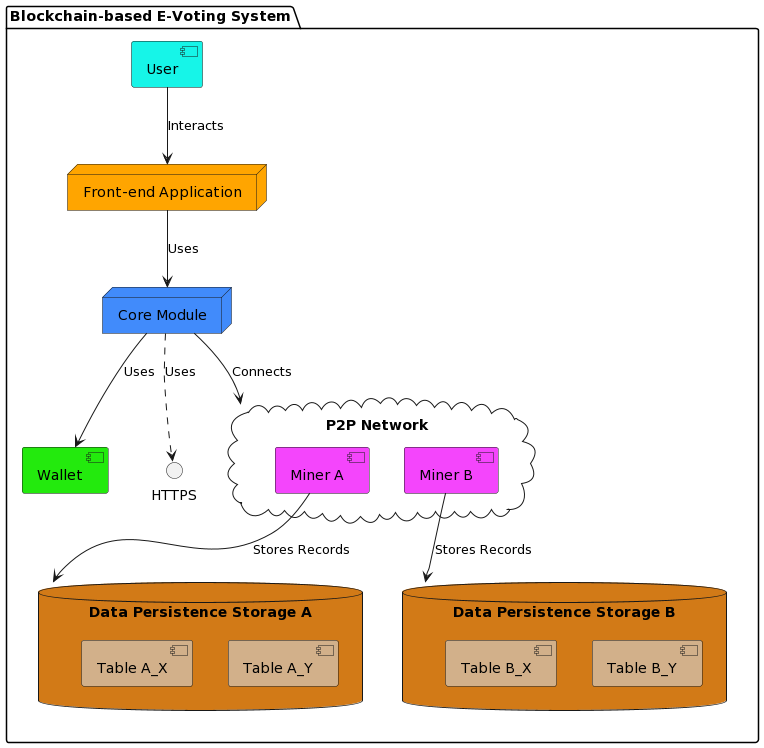

# Eon: Blockchain Voting for University Clubs

## About The Project
Eon is a Bitcoin-based blockchain voting system that utilizes the Blind Signature Protocol to ensure unlinkability between a voter and their ballot

This system can be used as a starting ground for University Club elections where the Central Authority would be the university and the Blockchain Network is the club hosting the election.

## Setup Environment
You must ensure that you have conda installed and once it is installed, the environment can be set up like so:
- conda env create --file environment.yml
- conda activate eon

## Running
You must be at the uppermost directory to run the programs (Cloned Directory). To run the following components of our project see below:
#### Voting Machine
- python3 -m src.frontend.app
#### Miner
- python3 -m src.p2p.mining_server

## Our Team

Myron Ladyjenko on the left and Eric Buys on the right